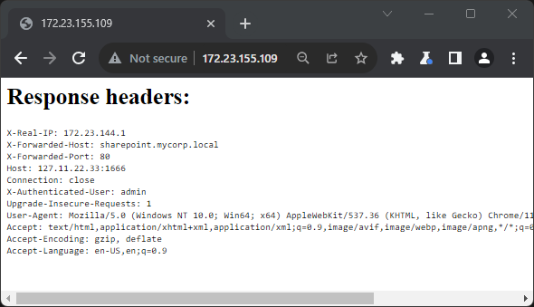

# HTTP Header Mirror
Request routers, reverse proxies, load balancers, authentication services, and various other HTTP doodads that sit between clients and backend servers can add or modify headers. HTTP Header Mirror is a web server that prints every header it receives to the page body, simplifying the process of testing for header injection vulnerabilities. HTTP Header Mirror has been helpful in discovering numerous vulnerabilities, including an issue with a CVSS 3.1 Base Score of 10 in a widely used product.

## Usage
```
./mirror.py -a 127.11.22.33 -p 1666
Connect to http://127.11.22.33:1666 to see headers. CTRL-C to quit.
```

## Example page
... using burp to spoof an nginx reverse proxy
